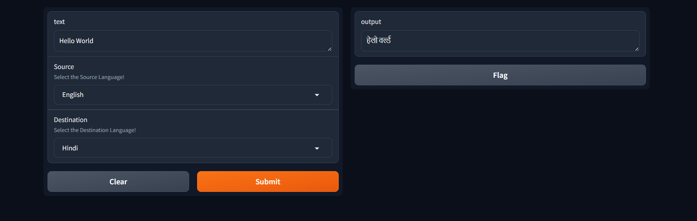
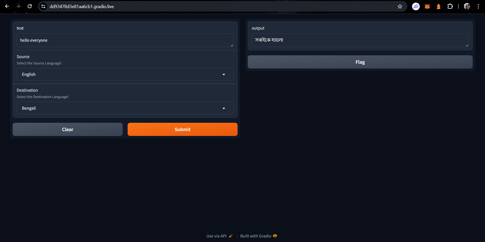

## Text to Text Translator

Built a Text to Text Translator using NLTK and Transformers.
- Supports Translation of English to Bengali, Tamil, Telugu, Gujarati, Marathi and Hindi.
-  Uses BanglaT5 which achieved an exceptional score of <b>25.2</b> on SacreBLEU metric while mt5 (Industry Standard) scored much lower at <b>22.5</b>

Future Work:
- Adding functionality of uploading Images and Files
- OCR will run on these files and provide translation automatically

## To Run Locally

- Run `python -m venv .venv`
- Run `.venv/Scripts/Activate`
- Run `pip install -r requirements.txt`
- Get your `HuggingFace Token` from `https://huggingface.co/settings/tokens`
- Generate a `Write` Token and store this in a file named `secret.py`
- Run `python app.py`

## Output

